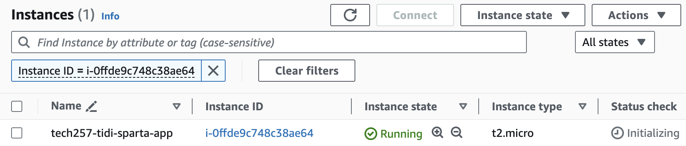
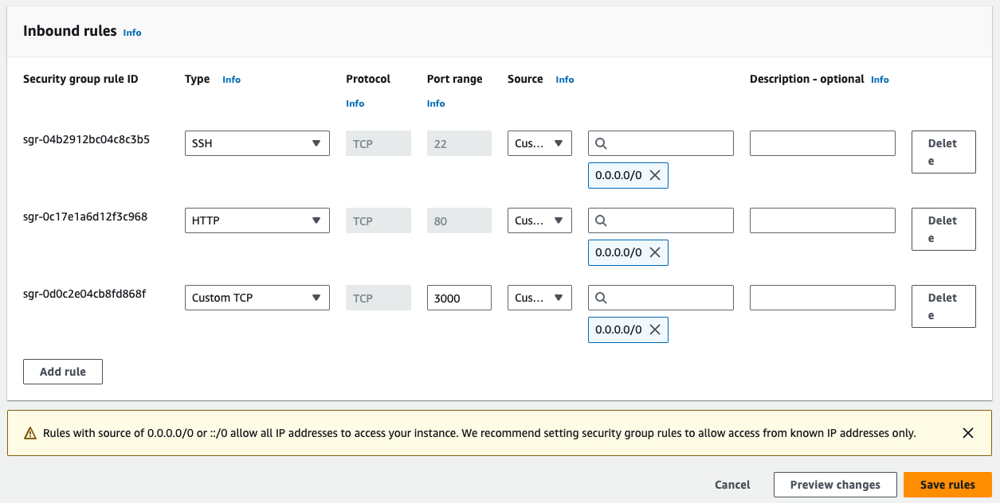
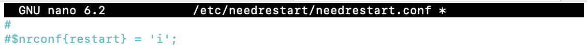

# Deploy App on AWS Virtual Machine

Prerequisities: AWS Account
Region: Ireland

## Create an Instance

- In the AWS Management console, search for `EC2`
- Click `Launch Instances`
- Configure the instance
  - Name: [desired-name]
  - Amazon Machine Image: choose `Ubuntu Server 22.04 LTS`
  - Instance type: t2.micro
  - Select your existing key pair stored in AWS.
  - Click `Launch instance`



## Edit the Security Group
By default, AWS creates a security group when launching an instance.

- In the LHS navigation pane of the instance just created, click `Security Groups` > security group ID.
- At the bottom, click **Edit inbound rules** to add a rule:
    - Type: Custom Type
    - Port range: 3000
    - Source type: Custom
    - Source: 0.0.0.0/0
- Click `Save changes`.



## SSH into the instance

- On the `Instances` dashboard, click your instance ID, click `Connect` > `SSH client` and follow the prompts provided.
- Copy and paste the prompt provided below where it says `Example`.
- On your local machine, open your command prompt terminal and paste that prompt and enter `yes`.

## Manually follow the commands:

- Update and upgrade:
  ```
  sudo apt-get update
  sudo DEBIAN_FRONTEND=noninteractive apt-get upgrade -y
  ```

- Install nginx (goes to the root): `sudo DEBIAN_FRONTEND=noninteractive apt install nginx -y`

- Configure file (uncomment and change) to restart services automatically: `sudo nano /etc/needrestart/needrestart.conf`


    

    

- Install nodejs and npm

    ```
    curl -fsSL https://deb.nodesource.com/setup_20.x | sudo -E bash - &&\
    sudo apt-get install -y nodejs
    ```

-  Install PM2
sudo npm install pm2@latest -g

- Clone the repo and navigate into the app folder

    ```
    git clone https://github.com/teeseira/tech257_sparta_app.git
    cd tech257_sparta_app/app/
    ```

- Install npm depencies: `sudo npm install`

- Use PM2 to start the app: `pm2 start app.js`