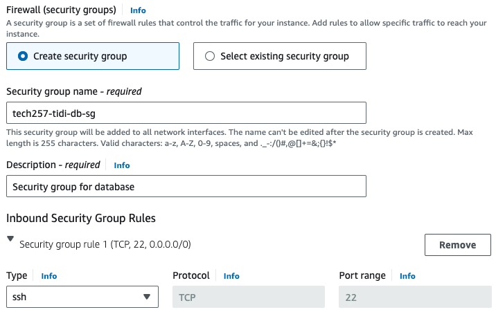

# Deployment on AWS Virtual Machine

- Prerequisities: AWS Account
- Region: Ireland

## Deploy App

### Create an Instance

- In the AWS Management console, search for `EC2`
- Click `Launch Instances`
- Configure the instance
  - Name: [desired-name]
  - Amazon Machine Image: choose `Ubuntu Server 22.04 LTS`
  - Instance type: `t2.micro`
  - Select your existing key pair stored in AWS.
    <br>

  - Network settings > click `Edit` > click `Add security group rule` > Type: `HTTP` > Source: `0.0.0.0/0`.
    <br>  

  - Click `Launch instance`.
  - Then click the instance ID to see its details.
    <br>

### Edit the Security Group
By default, AWS creates a security group when launching an instance.

- Navigate to the security group ID of this instance just created.
- At the bottom, click **Edit inbound rules** to add a rule:
    - Type: Custom TCP
    - Port range: 3000
    - Source type: Custom
    - Source: 0.0.0.0/0
    
- Click `Save rules`.

### SSH into the instance

- Back to the Instance ID for the Application, click `Connect` > `SSH client` and follow the prompts provided.
- Copy and paste the prompt provided below where it says `Example`.
- On your local machine, open your command prompt terminal and paste that prompt and enter `yes`.

### Manually vs Automated

#### Manually

- Update and upgrade:
  ```
  sudo apt-get update
  sudo DEBIAN_FRONTEND=noninteractive apt-get upgrade -y
  ```

- Install nginx (goes to the root): `sudo DEBIAN_FRONTEND=noninteractive apt install nginx -y`

- Configure file (uncomment and change) to restart services automatically: `sudo nano /etc/needrestart/needrestart.conf`

    
    <br>

- Install nodejs and npm:
    ```
    curl -fsSL https://deb.nodesource.com/setup_20.x | sudo -E bash - &&\
    sudo apt-get install -y nodejs
    ```

-  Install PM2: `sudo npm install pm2@latest -g`

- Clone the repo and navigate into the app folder:
    ```
    git clone https://github.com/teeseira/tech257_sparta_app.git
    cd tech257_sparta_app/app/
    ```

- Install npm depencies: `sudo npm install`

- Use PM2 to start the app: `pm2 start app.js`
  
  

- Test on Browser
  - Enter `<AppPublicIP>` in a new browser tab:
    <br>
  - Enter `<AppPublicIP>:3000` in a new broser tab:
    <br>

#### Scripting (Automate deployment of app with a Script)

You can achieve the same results by running a bash script instead of manually inputting commands.

- In home directory, create an .sh file with the following script:

    ```
    #!/bin/bash

    # Update the system
    sudo apt update -y

    # Upgrade the system to avoid user input
    sudo DEBIAN_FRONTEND=noninteractive apt-get upgrade -y

    # Update config file
    sudo sed -i "s/\$nrconf{restart} = 'i';/\$nrconf{restart} = 'a';/g" /etc/needrestart/needrestart.conf

    # Install nginx (goes to the root)
    sudo DEBIAN_FRONTEND=noninteractive apt install nginx -y

    # Start and enable nginx
    sudo systemctl restart nginx
    sudo systemctl enable nginx

    # Reverse proxy 
    sudo sed -i '51s|try_files .*;| proxy_pass http://localhost:3000;|' /etc/nginx/sites-available/default

    # Backup default file if default2 doesn't already exist
    if [ ! -f /etc/nginx/sites-available/default2 ]; then
        sudo cp /etc/nginx/sites-available/default /etc/nginx/sites-available/default2
    fi

    # Retart nginx
    sudo systemctl restart nginx

    # Install Node.js and npm
    curl -sL https://deb.nodesource.com/setup_20.x | sudo -E bash -
    sudo apt-get install -y nodejs

    # Install pm2
    sudo npm install pm2@latest -g

    # Clone the repo and navigate into the app folder
    git clone https://github.com/teeseira/tech257_sparta_app.git
    cd tech257_sparta_app/app/

    # Install npm depencies
    sudo npm install

    # Use PM2 to stop any currently running process, then to start the app
    pm2 stop all
    pm2 start app.js

    ```

### Reverse Proxy (using a Script)

The above script contains a reverse proxy which means we do not need to enter `<AppPublicIP>:3000` in the browser but rather `<AppPublicIP>`.
<br>

## Manually deploy Database to achieve Two-Tier Deployment

### Create an Instance for Database

- In the AWS Management console, search for `EC2`
- Click `Launch Instances`
- Configure the instance
  - Name: [desired-name]
  - Amazon Machine Image: choose `Ubuntu Server 22.04 LTS`
  - Instance type: `t2.micro`
  - Select your existing key pair stored in AWS.
  - Networking settings: [allow for SSH]
    <br>

  - Click `Launch instance`.
  - Then click the instance ID to see its details.
    <br>

#### Edit the Security Group
By default, AWS creates a security group when launching an instance.

- Navigate to the security group ID of this instance just created.
- At the bottom, click **Edit inbound rules** to add a rule:
    - Type: Custom Type
    - Port range: 27017
    - Source type: Custom
    - Source: 0.0.0.0/0
    <br>
- Click `Save changes`.

#### SSH into the instance

- On the `Instances` dashboard, click your instance ID, click `Connect` > `SSH client` and follow the prompts provided.
- Copy and paste the prompt provided below where it says `Example`.
- On your local machine, open your command prompt terminal and paste that prompt and enter `yes`.
- Then run this script:
    ```
    #!/bin/bash

    # Update and upgrade
    sudo apt-get update
    sudo DEBIAN_FRONTEND=noninteractive apt-get upgrade -y

    # Update config file
    sudo sed -i "s/\$nrconf{restart} = 'i';/\$nrconf{restart} = 'a';/g" /etc/needrestart/needrestart.conf

    # Get a GnuPG key
    sudo apt-get install gnupg curl
    curl -fsSL https://www.mongodb.org/static/pgp/server-7.0.asc | sudo gpg -o /usr/share/keyrings/mongodb-server-7.0.gpg --dearmor

    # Create a source list file
    echo "deb [ arch=amd64,arm64 signed-by=/usr/share/keyrings/mongodb-server-7.0.gpg ] https://repo.mongodb.org/apt/ubuntu jammy/mongodb-org/7.0 multiverse" | sudo tee /etc/apt/sources.list.d/mongodb-org-7.0.list

    # Update to get the latest mongodb packages
    sudo apt-get update -y

    # Install MongoDB 7.06
    sudo apt-get install -y mongodb-org=7.0.6 mongodb-org-database=7.0.6 mongodb-org-server=7.0.6 mongodb-mongosh=2.1.5 mongodb-org-mongos=7.0.6 mongodb-org-tools=7.0.6

    # Create backup for mongodb
    sudo cp /etc/mongod.conf /etc/mongod2.conf

    #Configure Mongodb's bindiP
    sudo sed -i 's@127.0.0.1@0.0.0.0@' /etc/mongod.conf

    # Start and enable the inactive mongod service 
    sudo systemctl start mongod
    sudo systemctl enable mongod
    ```

<!-- Note: you can SSH into database VM to check status: sudo systemctl status mongod -->

### Create an Instance for App

But this time export the Database Private IP address which is: `172.31.35.149` in this case:

```
export DB_HOST=mongodb://172.31.35.149:27017/posts
```
>Pass this in at the end of the bash script.

### Test on browser

- On a new browser tab, enter: `<AppPublicIP>/posts`


#### Troubleshooting


#### Solution

Export the Database Public IP address instead of the private one:
  ```
  export DB_HOST=mongodb://3.252.211.65:27017/posts
  ```
<!-- Run:
  ```
  pm2 stop all
  sudo kill -SIGTERM $(ps aux | grep '[p]m2' | awk '{print $2}')
  cd tech257_sparta_app/app
  sudo npm install
  sudo -E npm install
  sudo -E npm start
  ```-->

